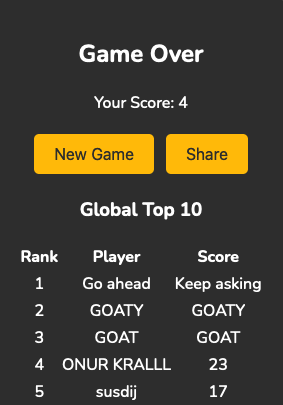

# Snake Game

This is an exercise for me to practice front/back end with all the basics.
Here we implement a simple Snake game with HTML, CSS, and JavaScript.
On the backend, we use Vercel along with MangoDB to make it a bit more interesting.

For me, the most important part was to make it a challenge for everyone.
So, there is a global leaderboard! If you are the best player, YOU WILL BE REMEMBERED!

But, it's a bit buggy lol.

## Features

- Responsive design for both desktop and mobile devices
- High-DPI canvas for sharp graphics
- Virtual joystick for mobile controls (and challenge)
- Share your score on social media
- **High score leaderboard with backend integration**

## How to Play

- **Desktop**: Use the arrow keys on your keyboard to control the snake.
- **Mobile Devices**: Use the virtual joystick to control the snake.
- Eat the green food to grow the snake and increase your score.
- Avoid running into the walls or the snake's own body.

## Live Demo

Play the game [here](https://eonurk.github.io/snake-game).